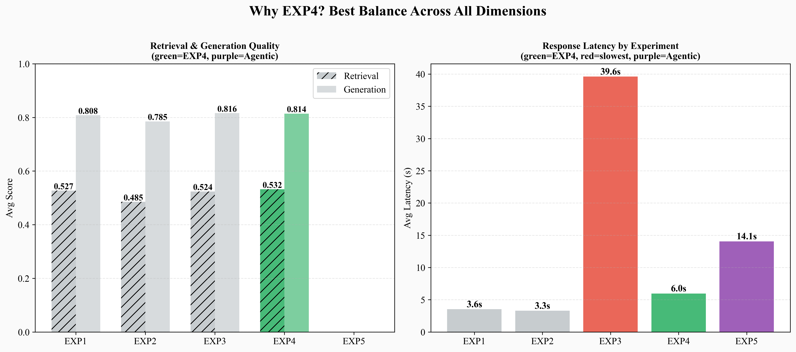
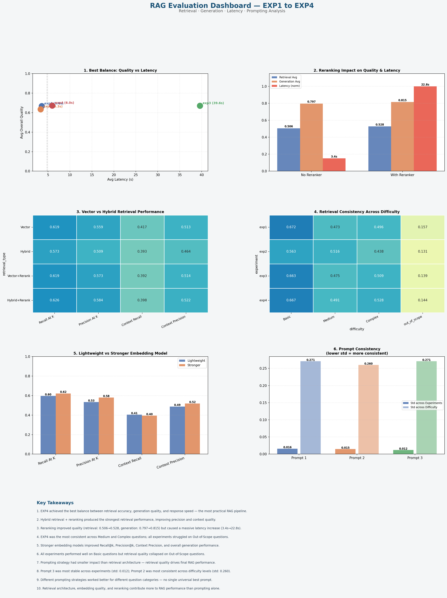
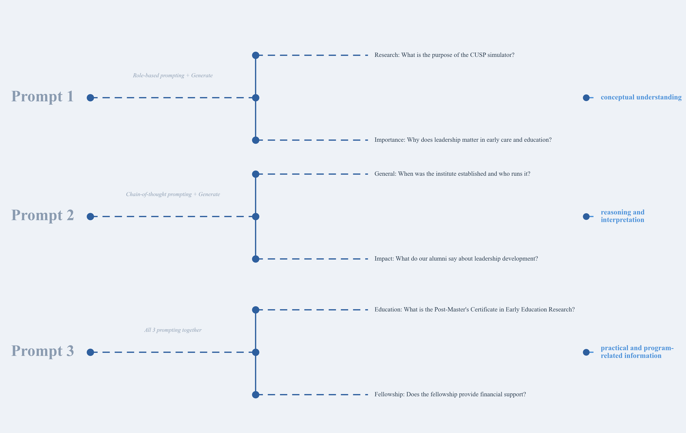

<p align="center">
  
</p>

<h1 align="center">EarlyEd Engine</h1>

<p align="center">
  <strong>AI-powered chatbot for the Institute for Early Education Leadership and Innovation at UMass Boston</strong><br>
  Human-verified answers grounded in curated sources — not hallucinations.
</p>

<p align="center">
  <a href="#"></a>
  <a href="#"></a>
  <a href="#"></a>
  <a href="#"></a>
  <a href="#"></a>
  <a href="#"></a>
</p>

<p align="center">
  <a href="#what-is-earlyEd-engine">What is EarlyEd?</a>&nbsp;&nbsp;&bull;&nbsp;&nbsp;
  <a href="#features">Features</a>&nbsp;&nbsp;&bull;&nbsp;&nbsp;
  <a href="#the-problem">The Problem</a>&nbsp;&nbsp;&bull;&nbsp;&nbsp;
  <a href="#demo">Demo</a>&nbsp;&nbsp;&bull;&nbsp;&nbsp;
  <a href="#how-it-works">How It Works</a>&nbsp;&nbsp;&bull;&nbsp;&nbsp;
  <a href="#evaluation">Evaluation</a>&nbsp;&nbsp;&bull;&nbsp;&nbsp;
  <a href="#data-sources">Data Sources</a>&nbsp;&nbsp;&bull;&nbsp;&nbsp;
  <a href="#team">Team</a>
</p>

---

## What is EarlyEd Engine?

<p align="center">
  
</p>

EarlyEd Engine is a conversational chatbot that answers questions about **programs, research, partnerships, and leadership development** at the UMass Boston Institute for Early Education Leadership and Innovation. It uses a human-verified knowledge base and vector search over curated sources — every answer cites where it came from.

> *"What do Early Education Leaders do?"*
>
> Early Education Leaders drives systems change in early care and education by investing in workforce and leadership development, research, and the broader early education ecosystem.
>
> **Sources:** [Early Education Leaders](https://www.umb.edu/early-education-leaders-institute/) | [Impact](https://www.umb.edu/early-education-leaders-institute/impact/) | [Offerings](https://www.umb.edu/early-education-leaders-institute/offerings/)

This is a **showcase repository**. We share our design, architecture, and evaluation results openly as a learning resource. Source code is maintained privately.

---

## Features

| | Feature | What It Does |
|---|---|---|
| :white_check_mark: | **Curated Q&A Path** | Human-verified answers for critical questions — AI output is checked against a reference answer before being shown |
| :mag: | **Vector Search Fallback** | For new questions, searches the full passage database using semantic similarity and returns grounded answers |
| :busts_in_silhouette: | **Role-Based Responses** | Adapts tone for students (simple, encouraging), professionals (formal, industry terms), and job seekers (opportunities-focused) |
| :link: | **Source Citations** | Every answer includes clickable links to the original UMass Boston pages |
| :shield: | **Safety Guardrails** | Detects and redacts personal information automatically — refuses off-topic questions |
| :speech_balloon: | **Session Memory** | Remembers what you said earlier in the conversation and refers back accurately |
| :globe_with_meridians: | **Language Detection** | Responds only in English with a polite redirect for other languages |
| :chart_with_upwards_trend: | **Built-in Evaluator** | Integrated evaluation UI for rating answer quality directly in the chat interface |

---

## The Problem

The Institute for Early Education Leadership and Innovation has a wealth of information across **research papers, blog posts, news articles, leadership forum materials, and web pages** — but it's scattered across dozens of documents and URLs. Students, professionals, and job seekers each need different information presented differently, and there's no single place to ask a question and get a verified, sourced answer.

**Specific challenges:**
- Information spread across 65+ documents and multiple web domains
- Different audiences need different tones and levels of detail
- No way to verify that AI-generated answers are actually grounded in real institute data
- Risk of hallucinated content in a domain where accuracy matters (programs, funding, partners)

---

## Demo

<p align="center">
  <video src="https://github.com/TaswarMahbub/EarlyEd-Engine/raw/main/assets/demo.mp4" width="600" controls>
    Your browser does not support the video tag.
  </video>
</p>

**The chat interface includes:**
- Sidebar navigation with topic categories (Who We Are, Programs, Impact, Research, Leadership Forum, Academics)
- Role selection (Student, Professional, Job Seeker) to personalize responses
- Suggested starter questions
- Real-time bot responses with formatted markdown and source links
- Built-in evaluator for answer quality assessment

**Try asking:**

| Question | What Happens |
|---|---|
| *"What do Early Education Leaders do?"* | Curated path — verified against human reference answer, returns with 5 source links |
| *"Who do we partner with?"* | Vector search — retrieves top passages about government, community, and philanthropic partners |
| *"What is the Leading for Change fellowship?"* | Vector search — pulls from fellowship program documents |
| *"What's the weather today?"* | Off-topic detection — politely redirects to EarlyEdLeaders@umb.edu |

---

## How It Works

EarlyEd Engine uses **two retrieval paths** — every answer is grounded in real data, with a human-verification layer for critical questions.

```
                         User asks a question
                                 |
                                 v
                      Embed question with
                      sentence-transformer
                                 |
                                 v
                   Compare to curated Q&A entries
                         (cosine similarity)
                                 |
                    ┌────────────┴────────────┐
                    |                         |
               High match                Low match
            (Curated Path)           (Unknown Question)
                    |                         |
                    v                         v
        Pull passages from           Vector search over
        human-specified URLs         full passage database
                    |                         |
                    v                         v
               LLM generates            LLM generates
               from context             from context
                    |                         |
                    v                         |
           Verify AI answer                   |
           against human reference            |
              |          |                    |
            PASS        FAIL                  |
              |          |                    |
         Return AI    Return human            |
          answer      reference               |
              |          |                    |
              └────┬─────┘                    |
                   └──────────┬───────────────┘
                              |
                              v
                   Append source links
                              |
                              v
                       Final Response
```

### The Two Paths

**Path 1 — Curated Questions (Human-Verified)**

For mission-critical questions, a human team member writes a reference answer and specifies exactly which source pages to use. The AI generates an answer from those sources, then it's automatically compared against the human reference using cosine similarity. If the AI answer doesn't pass the verification threshold, the human reference is returned instead. This guarantees accuracy for the most important questions.

**Path 2 — Unknown Questions (Vector Search)**

For everything else, the question is embedded and compared against the full passage database using cosine similarity. The most relevant passages are retrieved and passed to the LLM to generate a grounded answer. If no passage is sufficiently relevant, the user is directed to contact the institute directly.

### By the Numbers

| Metric | Value |
|---|---|
| Source documents | 65+ (.docx research, blogs, news, forums, web copy) |
| Passage database | Hundreds of chunked passages with sentence overlap |
| Embedding model | Sentence-transformer (384 dimensions) |
| LLM | GPT-4.1 via OpenRouter |
| Retrieval | Cosine similarity with configurable thresholds |
| Reranking | Cross-encoder reranking for hybrid search experiments |

---

## Evaluation

We ran **5 experiments** across 90 questions, comparing retrieval strategies, embedding models, rerankers, and LLMs. Each experiment was evaluated with both lexical metrics and independent LLM judges.

### Experiment Configurations

| Experiment | Strategy | Embedding | Reranker | LLM |
|---|---|---|---|---|
| EXP1 | Vector search | MiniLM | None | GPT-4o |
| EXP2 | Vector + query expansion | MiniLM | None | GPT-4o |
| EXP3 | Hybrid (vector + BM25) | MiniLM | BGE-Reranker | GPT-4o |
| EXP4 | Hybrid+ (upgraded models) | MPNet | MS-MARCO | GPT-4.1 |
| EXP5 | Agentic (multi-agent) | MPNet | MS-MARCO | GPT-4o |

### Key Findings

<p align="center">
  
</p>

**EXP4 achieved the best balance** across all dimensions:
- Highest retrieval score (0.814) and competitive generation quality (0.532)
- 6.0s average latency — 6.5x faster than EXP3 (39.6s) and 2.4x faster than EXP5 (14.1s)
- Most consistent across Basic, Medium, and Complex difficulty levels

<p align="center">
  
</p>

### Evaluation Metrics

**Lexical metrics (computed locally, no API):**
Recall@K, Precision@K, Context Recall, Context Precision, BERTScore, Faithfulness, Answer Relevance, Conciseness

**LLM judge metrics (two independent judges):**
Each answer scored by Llama 3.3 70B and Gemma 3 27B across 8 dimensions (16 columns total)

### Prompt Strategy

We tested 3 prompting approaches across all experiments:

<p align="center">
  
</p>

| Prompt | Approach | Strength |
|---|---|---|
| Prompt 1 | Role-based prompting + generate | Conceptual understanding |
| Prompt 2 | Chain-of-thought prompting + generate | Reasoning and interpretation |
| Prompt 3 | All 3 prompting approaches combined | Practical and program-related information |

---

## Data Sources

EarlyEd Engine's knowledge base is built from **65+ curated documents** across 6 categories, plus scraped web content.

| Category | Documents | Content |
|---|---|---|
| Research | 10 | Published research summaries on ECE workforce, leadership, and policy |
| Blogs | 30 | Fellow and educator stories, program experiences, community impact |
| News | 12 | Press releases, grant announcements, workforce study reports |
| Leadership Forum | 8 | Annual Early Educator Leadership Forum event materials |
| Leading for Change | 4 | Fellowship program documents across multiple states |
| Web Copy | 1 | General website and about-page content |
| Scraped Pages | 20+ | Live UMass Boston web pages (JSON, auto-scraped) |

All documents are processed through an ingestion pipeline that extracts text, chunks it into passages, encodes them with a sentence-transformer model, and stores everything in SQLite with full metadata (title, source, URL, date).

---

## Prompt Design

The system prompt is a **multi-section specification** that controls the AI's behavior:

| Section | Purpose |
|---|---|
| Identity & Role | Defines the assistant as an EarlyEd specialist at UMass Boston |
| Knowledge Source | All answers must come only from retrieved context — no outside knowledge |
| Conversation Flow | Step-by-step reasoning: understand question, check user type, retrieve, generate |
| Tone & Persona | Warm and encouraging by default; adapts to student/professional/job seeker |
| Language Detection | English-only responses with polite redirect |
| Output Formatting | Structured: topic heading, concise answer, source links with dates, contact footer |
| Link Generation | Only real URLs from context — never fabricated links |
| Limitations | No hallucination, concise answers only |
| Safety & Privacy | Automatic handling of sensitive user input |
| Fallback Escalation | Graceful redirect to EarlyEdLeaders@umb.edu for unanswerable questions |
| Conversation Memory | Remembers everything from the current session |
| Out-of-Scope Detection | Redirects off-topic questions to institute contact |

---

## Team

Built at **UMass Boston** — CS 438/638, Spring 2026.

| | |
|---|---|
| **HuuThanhVy Nguyen (Rami)** | **Justin J McMahon** |
| **Domenic B DiClemente** | **Igor Ten** |
| **Ajanee T Igharo** | **MeghSanjaykumar Patel** |
| **Felipe Mahecha** | **Syed Taswar Mahbub** |

---

<p align="center">
  <strong>Have questions about the project?</strong><br>
  Open an issue or reach out to any team member.
</p>

---

<p align="center">MIT License</p>
